# Domain Model — Trading Signal Tracker

Este archivo documenta el modelo de negocio completo del proyecto, incluyendo todas las entidades, sus propósitos, campos clave y la forma en que interactúan entre sí.

---

## Diagrama general

```mermaid
erDiagram

    %% ══════════════════════════════════════════
    %% ACCOUNTS — Usuarios y configuración
    %% ══════════════════════════════════════════

    USER {
        int     id
        string  email
        string  role
        boolean is_active
        boolean is_staff
        boolean is_superuser
    }

    USER_PROFILE {
        string  display_name
        string  country
        string  timezone
        int     experience_years
        string  notes
    }

    USER_RISK_PROFILE {
        decimal risk_per_trade_percent
        decimal max_daily_drawdown_percent
        int     max_open_trades
        boolean use_risk_suggestions
    }

    USER_TRADING_PREFERENCE {
        json    preferred_assets
        json    preferred_sessions
        boolean allow_crypto
        boolean allow_forex
        boolean auto_close_enabled
    }

    USER_NOTIFICATION_SETTING {
        boolean notify_trade_open
        boolean notify_trade_close
        boolean notify_drawdown_alert
        boolean email_notifications
        boolean push_notifications
    }

    USER ||--o| USER_PROFILE              : "perfil personal"
    USER ||--o| USER_RISK_PROFILE         : "perfil de riesgo"
    USER ||--o| USER_TRADING_PREFERENCE   : "preferencias"
    USER ||--o| USER_NOTIFICATION_SETTING : "notificaciones"

    %% ══════════════════════════════════════════
    %% ASSETS — Instrumentos financieros
    %% ══════════════════════════════════════════

    ASSET_TYPE {
        string name
        string description
    }

    ASSET {
        string  symbol
        string  name
        decimal pip_value
        int     price_decimals
        boolean is_tradable
    }

    ASSET_TRADING_SCHEDULE {
        int  day_of_week
        time start_time
        time end_time
    }

    ASSET_SWAP {
        decimal swap_long
        decimal swap_short
        int     triple_swap_day
    }

    ASSET_TYPE ||--|{ ASSET                  : "clasifica"
    ASSET      ||--o{ ASSET_TRADING_SCHEDULE : "horarios de trading"
    ASSET      ||--o{ ASSET_SWAP             : "configuracion de swap"

    %% ══════════════════════════════════════════
    %% TELEGRAM CONTROL — Cuentas y listener
    %% ══════════════════════════════════════════

    TELEGRAM_ACCOUNT {
        string  name
        int     api_id
        string  phone_number
        string  session_name
        int     pid
        boolean awaiting_2fa
        string  phone_code_hash
    }

    RAW_TELEGRAM_MESSAGE {
        bigint   telegram_message_id
        bigint   channel_id
        string   channel_title
        string   channel_username
        string   raw_text
        datetime message_date
        string   chat_type
        int      telegram_account_id
    }

    TELEGRAM_ACCOUNT ||--o{ RAW_TELEGRAM_MESSAGE : "recibe mensajes"

    %% ══════════════════════════════════════════
    %% SIGNALS — Señales de trading
    %% ══════════════════════════════════════════

    SIGNAL_SOURCE {
        string  name
        string  platform
        string  signal_style
        string  risk_profile
        string  timezone
        string  language
        boolean is_private
        bigint  telegram_channel_id
        string  telegram_channel_username
    }

    SIGNAL_PROVIDER {
        string  name
        string  alias
        boolean is_anonymous
        string  experience_level
        string  notes
    }

    TRADING_SIGNAL {
        string   direction
        decimal  entry_price
        decimal  stop_loss
        string   execution_type
        string   confidence_level
        string   session
        string   timeframe
        datetime signal_time
        string   status
        string   raw_message
    }

    SIGNAL_TAKE_PROFIT {
        decimal price
        int     level
        decimal percentage_close
    }

    SIGNAL_CONTEXT {
        string  market_condition
        string  volatility_level
        boolean news_related
        string  commentary
    }

    TELEGRAM_ACCOUNT ||--o{ SIGNAL_SOURCE    : "origen de mensajes"
    SIGNAL_SOURCE    ||--o{ SIGNAL_PROVIDER  : "tiene proveedores"
    SIGNAL_SOURCE    ||--o{ TRADING_SIGNAL   : "emite senales"
    SIGNAL_PROVIDER  }o--o{ TRADING_SIGNAL   : "provee"
    USER             ||--o{ SIGNAL_PROVIDER  : "puede ser usuario del sistema"
    ASSET            ||--o{ TRADING_SIGNAL   : "instrumento"
    TRADING_SIGNAL   ||--o{ SIGNAL_TAKE_PROFIT : "niveles TP"
    TRADING_SIGNAL   ||--o| SIGNAL_CONTEXT   : "contexto de mercado"

    %% ══════════════════════════════════════════
    %% TRADES — Operaciones ejecutadas
    %% ══════════════════════════════════════════

    TRADE_ACCOUNT {
        string  name
        string  broker
        decimal initial_balance
        string  currency
        boolean is_demo
    }

    TRADE {
        string   status
        string   direction
        datetime opened_at
        datetime closed_at
        string   notes
    }

    TRADE_ENTRY {
        decimal  entry_price
        decimal  lot_size
        datetime opened_at
        string   entry_source
        string   external_entry_id
    }

    TRADE_CLOSE {
        decimal  close_price
        decimal  lot_size
        datetime closed_at
        string   close_reason
        string   external_close_id
    }

    TRADE_CLOSE_RESULT {
        decimal pips_result
        decimal profit_loss
    }

    TRADE_COST {
        string  cost_type
        decimal amount
        date    incurred_at
    }

    USER          ||--o{ TRADE_ACCOUNT      : "posee cuentas"
    TRADE_ACCOUNT ||--o{ TRADE             : "ejecuta trades"
    ASSET         ||--o{ TRADE             : "instrumento"
    TRADING_SIGNAL ||--o{ TRADE            : "puede originar"
    TRADE         ||--o{ TRADE_ENTRY       : "entradas scaling-in"
    TRADE         ||--o{ TRADE_CLOSE       : "cierres parciales"
    TRADE         ||--o{ TRADE_COST        : "costos del trade"
    TRADE_CLOSE   ||--o| TRADE_CLOSE_RESULT : "resultado financiero"
    TRADE_CLOSE   ||--o{ TRADE_COST        : "costos del cierre"

    %% ══════════════════════════════════════════
    %% ANALYTICS — Métricas y análisis
    %% ══════════════════════════════════════════

    ANALYTICS_SNAPSHOT {
        date    period_start
        date    period_end
        string  snapshot_type
        int     total_trades
        int     winning_trades
        int     losing_trades
        decimal win_rate
        decimal net_profit
        decimal max_drawdown_percent
        string  notes
    }

    SIGNAL_PERFORMANCE {
        decimal theoretical_pips
        boolean hit_take_profit
        boolean hit_stop_loss
        int     tp_level_hit
        decimal max_favorable_excursion
        decimal max_adverse_excursion
    }

    USER_SIGNAL_STATS {
        date    period_start
        date    period_end
        int     total_signals
        int     followed_signals
        int     profitable_signals
        int     losing_signals
        decimal total_profit_loss
        decimal average_profit
        decimal average_loss
        decimal total_pips
        decimal average_rr
    }

    PROJECTION_SCENARIO {
        decimal initial_balance
        decimal risk_per_trade_percent
        int     projection_days
        decimal expected_return
        decimal expected_drawdown_percent
        string  notes
    }

    ANALYTICS_RUN {
        string   analysis_type
        datetime executed_at
        int      execution_time_ms
        boolean  success
        string   error_message
    }

    USER             ||--o{ ANALYTICS_SNAPSHOT  : "historial"
    TRADE_ACCOUNT    ||--o{ ANALYTICS_SNAPSHOT  : "filtra por cuenta"
    TRADING_SIGNAL   ||--o| SIGNAL_PERFORMANCE  : "performance teorica"
    USER             ||--o{ USER_SIGNAL_STATS   : "estadisticas"
    TRADE_ACCOUNT    ||--o{ USER_SIGNAL_STATS   : "filtra por cuenta"
    SIGNAL_SOURCE    ||--o{ USER_SIGNAL_STATS   : "filtra por fuente"
    SIGNAL_PROVIDER  ||--o{ USER_SIGNAL_STATS   : "filtra por proveedor"
    USER             ||--o{ PROJECTION_SCENARIO : "simulaciones"
    SIGNAL_SOURCE    ||--o{ PROJECTION_SCENARIO : "basado en fuente"
    USER             ||--o{ ANALYTICS_RUN       : "ejecuta calculos"
```



---

## Descripción por dominio

---

### ACCOUNTS — Usuarios y configuración

Este dominio representa a las personas que usan el sistema. Un `User` es la entidad raíz de autenticación y todo lo demás se construye en torno a él. El diseño separa los datos de autenticación (email, password, role) de los datos operativos (perfil, riesgo, preferencias), permitiendo que cada aspecto evolucione de forma independiente.

#### User
Es la entidad central del sistema. Todos los demás dominios giran en torno a ella de forma directa o indirecta.

- **Autenticación**: usa email como campo de login (no username). JWT via simplejwt.
- **Roles**: define el nivel de acceso y responsabilidad dentro de la plataforma.
  - `admin` — acceso total: usuarios, fuentes, señales, activos, configuración.
  - `analyst` — gestiona fuentes de señales (`SignalSource`, `SignalProvider`, `TradingSignal`). No opera trades propios.
  - `trader` — registra sus cuentas de trading, ejecuta trades y sigue señales.
- **Interacciones**: es el punto de origen de `TradeAccount`, `UserProfile`, `UserRiskProfile`, `UserTradingPreference`, `UserNotificationSetting`, `AnalyticsSnapshot`, `UserSignalStats`, `ProjectionScenario`, `AnalyticsRun`. También puede estar vinculado a un `SignalProvider` si el analista es usuario del sistema.

#### UserProfile
Información personal descriptiva del trader, separada de la autenticación para no contaminar el modelo de User con datos opcionales.

- **Propósito**: contextualizar al usuario dentro del sistema (país, zona horaria, experiencia).
- **Interacciones**: complementa a `User` con datos que sirven para personalización, reportes y futura segmentación.

#### UserRiskProfile
Define los parámetros de riesgo con los que el usuario quiere operar.

- **Propósito**: base para sugerencias automáticas de tamaño de lote, alertas de drawdown y validaciones de gestión de riesgo.
- **Campos clave**:
  - `risk_per_trade_percent` — cuánto del balance arriesgar por operación.
  - `max_daily_drawdown_percent` — límite de pérdida diaria antes de alertar.
  - `max_open_trades` — máximo de operaciones abiertas simultáneamente.
- **Interacciones**: en el futuro puede interactuar con `Trade` para validar o sugerir lotajes antes de abrir una posición.

#### UserTradingPreference
Preferencias operativas del usuario como trader.

- **Propósito**: filtrar señales relevantes, personalizar el dashboard y preparar automatizaciones futuras.
- **Campos clave**:
  - `preferred_assets` — lista de símbolos preferidos (JSON).
  - `preferred_sessions` — sesiones de mercado preferidas (Asia, London, New York).
  - `auto_close_enabled` — preparado para cierres automáticos por reglas.
- **Interacciones**: en el futuro puede interactuar con `TradingSignal` para filtrar automáticamente las señales que coinciden con las preferencias del usuario.

#### UserNotificationSetting
Controla qué eventos generan notificaciones y por qué canal.

- **Propósito**: evitar sobre-notificación y preparar el sistema para alertas por email, push o bot de Telegram.
- **Interacciones**: en el futuro se conectará con la capa de notificaciones cuando un `Trade` se abra, cierre o cuando el drawdown supere el límite del `UserRiskProfile`.

---

### ASSETS — Instrumentos financieros

Este dominio representa los instrumentos que se pueden operar. Es la capa de referencia que conecta señales y trades con el mercado real. Los assets son datos de catálogo: se crean una vez y se reutilizan en todo el sistema.

#### AssetType
Categoría del instrumento financiero.

- **Propósito**: clasificar activos para habilitar análisis y reglas diferenciadas por mercado.
- **Ejemplos**: Forex, Crypto, Commodities, Índices, Stocks.
- **Interacciones**: padre de `Asset`. Permite filtrar análisis por tipo de mercado.

#### Asset
El instrumento financiero operable en sí. Es la entidad de referencia que une señales con trades.

- **Propósito**: definir el instrumento con sus propiedades técnicas para cálculos precisos.
- **Campos clave**:
  - `symbol` — identificador único del instrumento (XAUUSD, EURUSD, BTCUSDT).
  - `pip_value` — valor monetario de un pip por lote estándar, esencial para calcular PnL.
  - `price_decimals` — decimales del precio, necesario para validaciones y display.
- **Interacciones**: referenciado por `TradingSignal` (la señal dice "compra XAUUSD") y por `Trade` (la operación se ejecuta en XAUUSD). También tiene `AssetTradingSchedule` y `AssetSwap` como configuración técnica.

#### AssetTradingSchedule
Horarios en los que un activo puede ser operado.

- **Propósito**: validar que señales y trades se emitan dentro del horario válido del mercado. Evitar operaciones fuera de mercado.
- **Ejemplo**: XAUUSD opera Lunes a Viernes; BTC opera todos los días 24/7.
- **Interacciones**: en el futuro puede bloquear la creación de `Trade` o la aceptación de `TradingSignal` si el activo no está en horario de trading.

#### AssetSwap
Tasas de swap (costo overnight) de un instrumento.

- **Propósito**: registrar el costo diario de mantener una posición abierta de un día para otro, especialmente relevante para trades swing.
- **Campos clave**:
  - `swap_long` / `swap_short` — costo para posiciones BUY y SELL respectivamente.
  - `triple_swap_day` — día en que el broker aplica triple swap (generalmente miércoles).
- **Interacciones**: se usa para calcular y registrar `TradeCost` de tipo `swap` en trades de largo plazo.

---

### TELEGRAM CONTROL — Cuentas y listener

Este dominio gestiona la integración con Telegram. Es el puente entre los canales de señales externos y el sistema de almacenamiento interno. Fue diseñado para soportar múltiples cuentas simultáneas, cada una con su propio proceso listener independiente.

#### TelegramAccount
Representa una cuenta de Telegram registrada en el sistema con sus credenciales de la API de Telegram.

- **Propósito**: centralizar las credenciales de acceso y el ciclo de vida de autenticación y conexión de cada cuenta.
- **Campos clave**:
  - `api_id` / `api_hash` — credenciales de la app en Telegram.
  - `session_name` — nombre del archivo de sesión en disco (`telegram_session_{digits}.session`).
  - `pid` — PID del proceso listener activo. `null` si está detenido.
  - `phone_code_hash` — hash temporal durante el flujo de autenticación (se borra al completar).
  - `awaiting_2fa` — indica si la cuenta tiene 2FA pendiente de verificar.
- **Ciclo de vida**: registro → request-code → verify-code → [verify-2fa] → connect → escucha mensajes → disconnect.
- **Interacciones**: cada cuenta puede estar vinculada a una o más `SignalSource` (el canal de Telegram es la fuente de señales). Cada mensaje recibido se almacena como `RawTelegramMessage` con referencia a la cuenta que lo recibió.

#### RawTelegramMessage
Almacena los mensajes de Telegram tal como llegan, sin ningún procesamiento.

- **Propósito**: preservar el mensaje original íntegro para futura IA de parseo. Es el punto de entrada de datos externos al sistema.
- **Campos clave**:
  - `raw_text` — texto completo del mensaje sin modificar.
  - `channel_id` / `channel_title` / `channel_username` — identificación del canal de origen.
  - `message_date` — momento real en que Telegram envió el mensaje.
  - `telegram_account_id` — qué cuenta de Telegram recibió el mensaje.
- **Interacciones**: en el flujo futuro, una IA o parser analizará `raw_text` y creará automáticamente un `TradingSignal` a partir del mensaje. El link entre `RawTelegramMessage` y `TradingSignal` aún no está implementado.

---

### SIGNALS — Señales de trading

Este dominio representa las señales tal como fueron emitidas por fuentes externas, independientemente de si el trader las ejecutó o no. Es el núcleo analítico del sistema: permite medir la calidad de las señales, comparar fuentes y proveedores, y vincular señales con trades reales.

#### SignalSource
La fuente de señales: un canal de Telegram, grupo de Discord, comunidad de WhatsApp, etc.

- **Propósito**: agrupar señales bajo un mismo origen para análisis de rentabilidad, consistencia y drawdown por fuente. Es la unidad principal de comparación entre proveedores de señales.
- **Campos clave**:
  - `platform` — plataforma de origen (telegram, discord, whatsapp, other).
  - `signal_style` — estilo de trading predominante (scalping, day trading, swing).
  - `risk_profile` — perfil de riesgo de la fuente (conservative, moderate, aggressive).
  - `telegram_channel_id` / `telegram_channel_username` — link directo al canal de Telegram para import automático de mensajes.
- **Interacciones**:
  - Se vincula a `TelegramAccount` cuando los mensajes llegan automáticamente por el listener.
  - Tiene múltiples `SignalProvider` (los analistas o personas que operan dentro del canal).
  - Emite múltiples `TradingSignal`.
  - Sirve como filtro en `UserSignalStats` y `ProjectionScenario` para análisis segmentados.

#### SignalProvider
Una persona, alias o identidad específica que emite señales dentro de una fuente.

- **Propósito**: análisis más granular que a nivel de fuente. Permite comparar el desempeño de distintos analistas dentro de un mismo canal, e identificar quién da las mejores señales.
- **Campos clave**:
  - `alias` — nombre o handle del analista en el canal.
  - `is_anonymous` — si la identidad es desconocida.
  - `experience_level` — nivel subjetivo del analista (Beginner, Pro, Unknown).
  - `user` — FK opcional a `User`. Si el analista también es usuario del sistema, se pueden cruzar sus señales con sus trades reales.
- **Interacciones**:
  - Pertenece a una `SignalSource`.
  - Puede estar vinculado a un `User` del sistema (útil cuando el analista también opera sus propias señales).
  - Sus `TradingSignal` son la base de `SignalPerformance` y `UserSignalStats`.

#### TradingSignal
La señal de trading tal como fue emitida: instrumento, dirección, precio de entrada, stop loss y take profits.

- **Propósito**: representar la intención original de la operación, independiente de si fue ejecutada y de cómo le fue al trader. Es la entidad central para medir calidad de señales.
- **Campos clave**:
  - `direction` — BUY o SELL.
  - `entry_price` / `stop_loss` — opcionales para señales de mercado sin precio definido.
  - `execution_type` — market, limit o stop.
  - `signal_time` — momento real en que se emitió la señal (no cuándo se registró).
  - `status` — active, cancelled, expired, hit_tp, hit_sl.
  - `raw_message` — texto original de la señal para referencia y auditoría.
  - `confidence_level` — nivel de confianza de la señal (low, medium, high).
  - `session` — sesión de mercado en la que se emitió (asia, london, new_york).
- **Interacciones**:
  - Pertenece a una `SignalSource` y opcionalmente a un `SignalProvider`.
  - Referencia un `Asset` (el instrumento a operar).
  - Tiene múltiples `SignalTakeProfit` (TP1, TP2, TP3...).
  - Puede tener un `SignalContext` con metadata del mercado.
  - Puede originar uno o más `Trade` cuando el usuario decide ejecutarla.
  - Tiene un `SignalPerformance` que mide su resultado teórico.

#### SignalTakeProfit
Los niveles de take profit de una señal, ordenados por nivel.

- **Propósito**: registrar los objetivos de ganancia de la señal con precisión. Permite medir cuántas señales alcanzan TP1, TP2, TP3 y calcular el rendimiento real por nivel.
- **Campos clave**:
  - `level` — número de TP (1, 2, 3...). Único por señal.
  - `price` — precio objetivo.
  - `percentage_close` — qué porcentaje de la posición se cierra al alcanzar este nivel (ej: 50% en TP1, 50% en TP2).
- **Interacciones**: referenciado por `SignalPerformance` (campo `tp_level_hit`) para saber hasta qué TP llegó la señal teóricamente.

#### SignalContext
Información contextual del mercado en el momento de la señal.

- **Propósito**: enriquecer la señal con datos cualitativos que no siempre vienen en el mensaje original, pero son clave para análisis avanzados y futuras automatizaciones.
- **Campos clave**:
  - `market_condition` — tendencia (trending) o rango (ranging).
  - `volatility_level` — volatilidad del momento (low, medium, high).
  - `news_related` — si la señal está relacionada con algún evento de noticias.
  - `commentary` — notas adicionales del analista.
- **Interacciones**: permite filtrar en el futuro qué condiciones de mercado generan mejores señales. Base para sistemas de IA que aprendan bajo qué contextos operan mejor ciertas fuentes.

---

### TRADES — Operaciones ejecutadas

Este dominio representa las operaciones reales que el trader ejecuta en su broker. Es completamente independiente de las señales: un trade puede originarse en una señal o ser completamente manual. El diseño permite representar la complejidad real del trading: múltiples entradas (scaling-in), cierres parciales y costos granulares.

#### TradeAccount
La cuenta de broker donde se ejecutan las operaciones.

- **Propósito**: separar resultados por cuenta, permitiendo análisis diferenciados entre cuentas demo, real o de copy trading. Un usuario puede tener N cuentas.
- **Campos clave**:
  - `broker` — nombre del broker (IC Markets, Binance, etc.).
  - `initial_balance` — capital inicial para calcular rentabilidad porcentual.
  - `currency` — moneda de la cuenta (USD, EUR, etc.).
  - `is_demo` — diferencia cuentas de práctica de cuentas reales.
- **Interacciones**:
  - Pertenece a un `User`.
  - Contiene múltiples `Trade`.
  - Sirve como filtro en `AnalyticsSnapshot`, `UserSignalStats` para métricas por cuenta específica.

#### Trade
El trade lógico completo: desde que se abre hasta que se cierra totalmente.

- **Propósito**: agrupar bajo un mismo paraguas todas las entradas y cierres de una operación, reflejando cómo se opera realmente en plataformas como MT5 o Binance donde una misma posición puede tener múltiples tickets.
- **Campos clave**:
  - `status` — open, partially_closed, closed.
  - `direction` — buy o sell (denormalizado del `TradeEntry` para consultas rápidas).
  - `opened_at` / `closed_at` — duración total de la operación.
  - `trading_signal` — FK opcional que vincula el trade con la señal que lo originó.
- **Interacciones**:
  - Pertenece a un `TradeAccount` y referencia un `Asset`.
  - Tiene múltiples `TradeEntry` (entradas escalonadas).
  - Tiene múltiples `TradeClose` (cierres parciales o totales).
  - Tiene múltiples `TradeCost` (costos globales del trade como swap diario).
  - Se vincula opcionalmente a un `TradingSignal` para cruzar el resultado real con la señal original.

#### TradeEntry
Un evento de apertura de posición dentro de un trade.

- **Propósito**: registrar cada entrada al mercado por separado, permitiendo calcular el precio promedio de entrada cuando se hace scaling-in.
- **Campos clave**:
  - `entry_price` / `lot_size` — precio y tamaño de esta entrada específica.
  - `entry_source` — manual, bot o API (origen de la apertura).
  - `external_entry_id` — ID del ticket en el broker (MT5 position ID, Binance order ID) para reconciliación futura.
- **Interacciones**: pertenece a un `Trade`. El precio promedio de todos los `TradeEntry` de un trade determina el punto de breakeven real.

#### TradeClose
Un evento de cierre de posición, parcial o total.

- **Propósito**: registrar cada cierre por separado para calcular PnL granular y entender si el trader tomó ganancias parciales o dejó correr la posición.
- **Campos clave**:
  - `close_price` / `lot_size` — precio y lote cerrado en este evento.
  - `close_reason` — tp, sl, manual o bot.
  - `external_close_id` — ID del cierre en el broker.
- **Interacciones**:
  - Pertenece a un `Trade`.
  - Tiene un `TradeCloseResult` con el PnL calculado de ese cierre específico.
  - Puede tener `TradeCost` asociados (ej: comisión cobrada en el momento del cierre).

#### TradeCloseResult
El resultado financiero de un cierre específico.

- **Propósito**: separar el cálculo del PnL del evento de cierre en sí, permitiendo recalcularlo sin modificar el registro histórico de cierre.
- **Campos clave**:
  - `pips_result` — pips ganados o perdidos en este cierre.
  - `profit_loss` — monto monetario en la divisa de la cuenta.
- **Interacciones**: relación 1:1 con `TradeClose`. La suma de todos los `TradeCloseResult` de un trade es el PnL total de la operación.

#### TradeCost
Un costo operativo asociado a un trade o a un cierre específico.

- **Propósito**: registrar todos los costos reales de operar (swap, comisiones, fees) para calcular el PnL neto real y no solo el bruto.
- **Campos clave**:
  - `cost_type` — swap, commission, fee, other.
  - `amount` — monto del costo (generalmente negativo).
  - `incurred_at` — fecha en que se incurrió el costo. Especialmente útil para swap diario en trades swing donde el costo se acumula día a día.
- **Regla de negocio**: debe estar vinculado a un `Trade` O a un `TradeClose`, nunca a ninguno de los dos.
- **Interacciones**: los costos a nivel de `Trade` son cargos globales (swap diario). Los costos a nivel de `TradeClose` son cargos por cierre (comisión del broker). La suma de todos los costos afecta el PnL neto final.

---

### ANALYTICS — Métricas y análisis

Este dominio es la capa de inteligencia del sistema. Consume datos de todos los demás dominios para producir métricas, rankings, simulaciones y auditoría de procesos. Actualmente los modelos están definidos y los datos se pueden cargar manualmente; el siguiente paso es implementar la lógica de cálculo automático.

#### AnalyticsSnapshot
Una foto histórica de las métricas de trading de un usuario en un período.

- **Propósito**: evitar recalcular métricas históricas constantemente. Permite dashboards rápidos y comparaciones entre períodos sin tocar datos en bruto.
- **Campos clave**:
  - `snapshot_type` — granularidad: daily, weekly, monthly.
  - `win_rate` — porcentaje de trades ganadores.
  - `net_profit` — ganancia neta del período.
  - `max_drawdown_percent` — máxima caída desde un pico en el período.
- **Interacciones**:
  - Pertenece a un `User`.
  - Se puede filtrar por `TradeAccount` para métricas por cuenta específica.
  - En el futuro se generará automáticamente por `AnalyticsRun`.

#### SignalPerformance
El resultado teórico de una señal, medido de forma objetiva independiente del trader.

- **Propósito**: evaluar la calidad real de las señales emitidas por una fuente o proveedor, sin importar si el trader las ejecutó o cómo las gestionó. Base para rankings de fuentes.
- **Campos clave**:
  - `theoretical_pips` — pips que hubiera ganado si se hubiera ejecutado perfectamente.
  - `hit_take_profit` / `hit_stop_loss` — si la señal llegó a su objetivo o a su stop.
  - `tp_level_hit` — hasta qué nivel de TP llegó (1, 2, 3...).
  - `max_favorable_excursion` — hasta dónde fue el precio a favor antes de revertir.
  - `max_adverse_excursion` — hasta dónde fue el precio en contra antes de recuperar.
- **Interacciones**: relación 1:1 con `TradingSignal`. Permite cruzar el resultado teórico de la señal con el resultado real del `Trade` para medir cuánto capturó el trader del movimiento.

#### UserSignalStats
Estadísticas agregadas de las señales seguidas por un usuario en un período.

- **Propósito**: medir qué tan bien le va a un usuario siguiendo señales de determinadas fuentes. Diferencia del `AnalyticsSnapshot` en que está centrado en señales, no en trades.
- **Campos clave**:
  - `followed_signals` — cuántas señales del total decidió ejecutar.
  - `profitable_signals` / `losing_signals` — resultado de las señales seguidas.
  - `total_profit_loss` / `total_pips` — resultado acumulado.
  - `average_rr` — ratio riesgo/beneficio promedio de las señales seguidas.
- **Interacciones**:
  - Pertenece a un `User`.
  - Se puede filtrar por `TradeAccount`, `SignalSource` y `SignalProvider` para análisis segmentado.
  - Permite responder preguntas como "¿cuánto gané siguiendo el canal X en marzo?"

#### ProjectionScenario
Simulación de crecimiento de capital basada en parámetros de riesgo e historial.

- **Propósito**: que el usuario pueda visualizar distintos escenarios futuros antes de cambiar su gestión de riesgo. Herramienta de planificación.
- **Campos clave**:
  - `initial_balance` — capital de partida de la simulación.
  - `risk_per_trade_percent` — riesgo por operación en el escenario simulado.
  - `projection_days` — horizonte temporal de la proyección.
  - `expected_return` / `expected_drawdown_percent` — resultado calculado de la simulación.
- **Interacciones**:
  - Pertenece a un `User`.
  - Puede basarse en una `SignalSource` específica para proyectar con las estadísticas reales de esa fuente.

#### AnalyticsRun
Registro de auditoría de cada vez que se ejecutó un proceso de cálculo analítico.

- **Propósito**: poder monitorear cuándo, para quién y con qué resultado se ejecutaron los procesos de analytics. Útil para debugging, monitoreo y throttling.
- **Campos clave**:
  - `analysis_type` — tipo de proceso: snapshot, ranking, projection.
  - `execution_time_ms` — duración del cálculo para detectar procesos lentos.
  - `success` / `error_message` — resultado de la ejecución.
- **Interacciones**: pertenece a un `User`. En el futuro cada generación automática de `AnalyticsSnapshot`, ranking de `SignalSource` o cálculo de `ProjectionScenario` registrará un `AnalyticsRun`.

---

## Flujos de negocio principales

### Flujo 1 — Captura automática de señales desde Telegram
```
TelegramAccount (autenticada y conectada)
  → listener subprocess escucha mensajes en tiempo real
    → RawTelegramMessage (guardado en bruto)
      → [futuro] IA/parser analiza raw_text
        → TradingSignal creada automáticamente
          → SignalTakeProfit (TP1, TP2, TP3...)
          → SignalContext (condiciones de mercado)
```

### Flujo 2 — Ejecución de una señal como trade
```
TradingSignal (señal recibida y evaluada)
  → Trader decide ejecutarla
    → Trade (vinculado a la señal, en TradeAccount del usuario)
      → TradeEntry (entrada al mercado con precio y lote)
      → [si swing] TradeCost (swap diario con incurred_at)
      → TradeClose (cierre parcial en TP1)
        → TradeCloseResult (PnL del cierre)
        → TradeCost (comisión del broker)
      → TradeClose (cierre final en TP2 o SL)
        → TradeCloseResult
```

### Flujo 3 — Análisis de calidad de una fuente de señales
```
SignalSource
  → TradingSignal[] emitidas
    → SignalPerformance (resultado teórico de cada señal)
      → tp_level_hit, theoretical_pips, MFE/MAE
    → Trade[] ejecutados por usuarios que siguieron la señal
      → TradeCloseResult[] (resultado real vs teórico)
  → UserSignalStats (estadísticas agregadas por usuario/período)
  → AnalyticsSnapshot (snapshot de rendimiento global)
```

### Flujo 4 — Registro manual de trade (sin señal)
```
User → TradeAccount (cuenta del broker)
  → Trade (manual, sin trading_signal)
    → TradeEntry (precio y lote de entrada)
    → TradeCost (comisión de apertura)
    → TradeClose (cierre manual o por SL/TP)
      → TradeCloseResult (PnL calculado)
```

---

## Estado actual por dominio

| Dominio | Modelos | API | Lógica de negocio |
|---|---|---|---|
| Accounts | Completo | Completo | JWT auth funcional |
| Assets | Completo | Completo | Solo catálogo, sin validaciones automáticas |
| Telegram Control | Completo | Completo | Listener funcional, parseo de IA pendiente |
| Signals | Completo | Completo | Registro manual funcional, auto-parseo pendiente |
| Trades | Completo | Completo | Registro manual funcional, integración broker pendiente |
| Analytics | Modelos completos | Completo | Sin lógica de cálculo automático aún |
